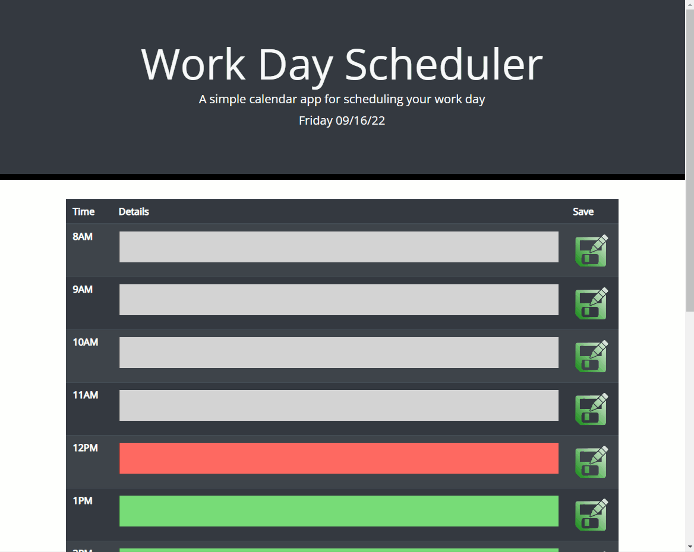

# day-planner

## Description

Effective tool for planning and scheduling your day. Features:

-   Current day and date displayed at top of page.
-   Editable time slots from 8am until 9pm.
-   Save button that stores your notes in local storage for later use.
-   Page loads previously saved data incase of refresh or webpage change.
-   Deployed to github for public use at [https://abrowncownow.github.io/day-planner/](https://abrowncownow.github.io/day-planner/)
-   Repo can be viewed at [https://github.com/abrowncownow/day-planner/](https://github.com/abrowncownow/day-planner/)

## Table of Contents

Use the links below to navigate to different sections of the README.

-   [Installation](#installation)
-   [Usage](#usage)
-   [Credits](#credits)
-   [License](#license)

## Installation

Website deployed to web via github pages for public use. No installation necessary.

## Usage

Navigate to page in browser. Current date will be displayed at the top of the scren. Click on the text field next to the corresponding time. Enter appointments and/or notes. Push the green 'save' icon on the right side of the text box. Data will be saved in local storage and retrieved upon page reload so that user doesn't lose data.

## Credits

Developed by Alex Brown. [Bootstrap](https://getbootstrap.com/) used as css framework. Fonts supplied by [Font Awesome](https://fontawesome.com/) and [Google Fonts](fonts.google.com). Save icon from [Iconduck](https://iconduck.com/).

## License

Please refer to the LICENSE in the repo.
